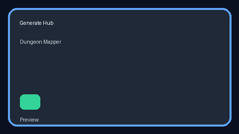
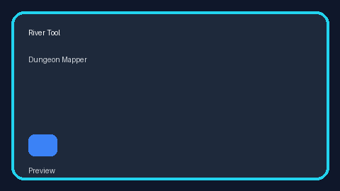
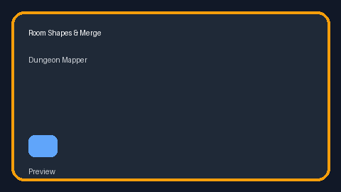

# ⚔ Dungeon Mapper

**Make battle maps that look great fast, then keep polishing until they feel like your table.**

[](https://github.com/evillollive/Dungeon-Mapper/actions/workflows/ci.yml)


Dungeon Mapper is a local-first grid map editor for tabletop RPG prep and play. Keep projects in **Your maps**, build an encounter, prepare its public content, then run a separately saved session with a read-only local player display. Export private editable backups, player images or print pages from the browser.

**Try it now:** [evillollive.github.io/Dungeon-Mapper](https://evillollive.github.io/Dungeon-Mapper/)

The current workflow is documented below. The [release gates](./docs/USER-EXPERIENCE-ROADMAP.md#release-gate-ledger) remain open; the hosted app and passing individual checks are not full release or device qualification.

## Who it's for

| Audience | What Dungeon Mapper helps with |
| --- | --- |
| Game masters | Prep battle maps, reveal them safely at the table, and keep notes/tokens nearby. |
| Solo designers | Rapidly explore room layouts, terrain, rivers, villages, and theme variants. |
| TTRPG hackers | Study a compact React + TypeScript canvas app with procedural generation, FOV, fog, export, PWA, and accessibility work. |

## Why it's interesting

- **Fast first draft, deep polish later.** Start from a blank grid, a sample project, or one of four deterministic generators, then keep refining with stamps, vectors, notes, themes, art layers, and exports.
- **Separate prep from play.** Prepare visibility and public notes in Edit, then reveal cells, move tokens and advance turns in Run without overwriting the authored map.
- **Themeable without losing structure.** The same map data can become a dungeon, castle, starship, cyberpunk street, wilderness trail, pirate ship, desert site, and more.
- **Local-first and portable.** Projects auto-save to this browser's IndexedDB. Private JSON backups keep a separate copy; verified app caching enables offline use. Neither device storage nor the cache is a backup.

## Quick start

Use the hosted app if you just want to make a map:

1. Open the [app](https://evillollive.github.io/Dungeon-Mapper/). From **Your maps**, choose **Create map**, **Open a sample** or **Import project**. A returning visit can reopen your last project.
2. Choose a starting point, preview it, then select **Use this map**. Samples and imports become separate editable projects.
3. Use **Build**, **Decorate** and **Look** to edit. Open **Project menu > Project settings** for dimensions and interface text size. Wait for **Saved on this device**.
4. Review **Player preview**, including public note fields, hidden tokens and fog. The editor and legacy **DM view** are trusted DM surfaces, not player displays.
5. Choose **Prepare session**, review visibility and acknowledge the checklist, then **Start session**. Run saves progress separately from the source project.
6. Choose **Open player display** for a second window in the same browser, then **Show this level**. Use **Pause / blank now** to blank it. This is not a remote share link.
7. Use **Export > Back up project** for private editable JSON or **Share with players** for an audience-filtered PNG/SVG. Before leaving Run, save/end or leave the session for later resumption.

Project backups do **not** include separate session records. In Run, **Download session recovery** retains private session data; there is no dedicated importer for that file. See [saving and recovery](./docs/FEATURES.md#saving-exporting--importing).

Run it locally when you want to hack on the project:

```bash
npm install
npm run dev
```

Open the local URL printed by Vite, usually `http://localhost:5173`.

## Feature highlights

| Area | Highlights |
| --- | --- |
| Map editing | 8×8 to 128×128 grids, 20 built-in tile types, custom themes/tiles, undo/redo, copy/cut/paste, background-image tracing, multi-level stair links. |
| Generation | Rooms & Corridors, Open Terrain, Cavern, and Village generators with deterministic seeds, density controls, tile mixes, room labels, rivers, and generate-into-selection workflows. |
| Table tools | Prepare/Run workflow, local read-only player display, explicit publication and blanking, fog, tokens, initiative, measurement and session checkpoints. |
| Art and themes | 13 legacy themes plus Dungeon Folio, monochrome print companions, paper textures, edge blending, hand-drawn rendering, lighting, stamps, vectors and scene templates. |
| Portability | IndexedDB auto-save, JSON import/export, PNG/SVG export, high-DPI print export, installable PWA, and offline service-worker caching. |

## Visual tour

These retained clips show earlier editor layouts, not the current first-use or session flow.

| Generate maps | Draw rivers | Shape rooms |
| --- | --- | --- |
|  |  |  |

## Documentation map

The README is intentionally a landing page. The detailed reference material is preserved in focused docs:

| Need | Start here |
| --- | --- |
| Full feature tour and tool reference | [Feature Reference](./docs/FEATURES.md) |
| Project architecture | [Architecture](./docs/ARCHITECTURE.md) |
| Setup, scripts, and test structure | [Development Guide](./docs/DEVELOPMENT.md) |
| DM/player workflow and visual redesign plan | [End-user Experience Roadmap](./docs/USER-EXPERIENCE-ROADMAP.md) |
| Roadmap and competitive analysis | [Roadmap](./docs/ROADMAP.md) |
| Sharing and launch copy | [Sharing Guide](./docs/SHARING.md) |
| Release notes | [Changelog](./CHANGELOG.md) |
| Contribution expectations | [Contributing](./CONTRIBUTING.md) |

## Commands

```bash
npm install       # install dependencies
npm run dev       # start Vite dev server
npm run build     # type-check and build production assets
npm run preview   # preview the production build
npm run lint      # run ESLint
npm test          # run the Vitest suite once
npm run test:watch
```

The project targets Node.js 20+ and npm 10+. CI requires build/test and three-engine browser qualification for pull requests and pushes to `main`. The checked-in workflow gates Pages packaging and deployment on those checks using one verified build artifact. This policy is locally implemented but still awaits hosted verification; see [release qualification](./docs/UX-09-HANDOFF.md#rollout-and-rollback) rather than treating deployment as approval.

## Format notes and caveats

- JSON is the editable project format and includes levels, tiles, notes, tokens, stair links, themes, fog, stamps, vectors, and metadata.
- PNG, SVG, and print exports are share/print formats, not import formats.
- The app is browser-based and client-only; there is no account system or hosted project sync.
- Custom uploaded graphics are stored with the project export, so keep file-size limits in mind for portable maps.
- Open **Offline & updates** while online and wait for **App and built-in art cached.** before relying on offline use. Updates wait for an explicit **Update saved workspace** request after saving and closing other app windows.
- Printing supports A4/Letter PNG pages. Use actual size / 100%; physical scale, overlap and readability qualification remain open.
- Responsive and keyboard workflows exist, but physical mobile/touch/pen, native zoom, screen-reader and participant acceptance are not established by automated browser results.

## Contributing

Found a bug, built a cool improvement, or have a quality-of-life tweak that would make prep smoother? Please read [CONTRIBUTING.md](./CONTRIBUTING.md) before opening a pull request.

## License

AGPL-3.0 © Alex Perrault
