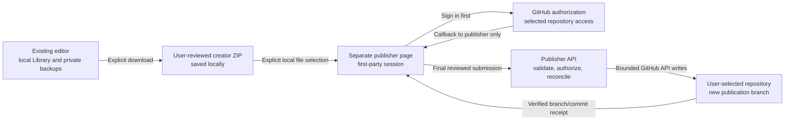

# Optional GitHub publisher design

**Date:** September 30, 2026.
**Status:** Local architecture direction approved and a bounded GH-N08
authentication simulation implemented. Production operating decisions remain
open. No live authentication service, GitHub App, domain or infrastructure
has been created.
**Parent:** [GitHub integration roadmap](./GITHUB-INTEGRATION-ROADMAP.md).

## 1. Approved direction

The owner approved planning a minimal optional hosted service and selected
**keep the existing editor URL and add a separate publishing page**.
These are architecture decisions, not provisioning or spending approval.
The owner subsequently approved a portable Node prototype using local test
providers, explicitly deferring host selection until local sizing.

The existing editor remains local-first at its current Pages origin.
Its IndexedDB Library, recovery records, player-display channel and offline
cache stay there. No domain change, redirect, storage migration or automatic
copy of local records is part of this design.

The publisher is a separate, first-party HTTPS page with its own backend.
Its first version accepts a creator ZIP that the user has already reviewed
and downloaded. It is not another editor, a cloud map library or a session
backup service. It never asks for a private project/session backup.

This deliberately adds one file-selection step. In exchange, it avoids
cross-site authentication cookies, credential relay through the editor,
cross-window message protocols and forced origin changes. A later streamlined
handoff would be a separate UX/security decision, not an implicit extension.

## 2. Why the publishing page is separate

The current implementation is a static React/Vite/PWA application:

- `vite.config.ts` builds the Pages application under `/Dungeon-Mapper/`.
- `src/service-worker.ts` precaches the static distribution and serves
  application navigations from `index.html`.
- Local projects and recovery are bound to the browser origin.
- Creator ZIP/folder creation, inspection and independent import already work
  without any account or service.

A new editor domain would not automatically have access to the existing
origin's IndexedDB data. Putting a cookie-authenticated API on an unrelated
site would also introduce third-party-cookie restrictions. The approved
separate page keeps authentication first-party without changing browser privacy
settings, requesting cross-site storage access or relying on temporary popup
cookie exceptions.

Do not put an OAuth callback under the editor's current service-worker
navigation scope. Do not change Pages DNS or the existing deploy topology
to implement this companion. Its UI/API share one origin; its service does
not register the editor's service worker.

## 3. First-version user flow

1. In the editor, review and download the normal creator package. An optional
   link can open the publisher in a new tab with `noopener` and `noreferrer`.
   No package, token, receipt capability or private filename goes in that URL.
2. Sign in to GitHub on the publisher before choosing a file. OAuth navigation
   must not require retaining a selected package across page reloads.
3. Select the ZIP locally in the publisher tab. Inspect it in browser memory,
   including member hashes, profile, licenses, source notices and previews.
   File selection alone does not upload it.
4. Choose an existing repository the user and installed GitHub App can both
   access. Show the authenticated GitHub account independently of the package's
   declared creator. Login is not proof of copyright ownership.
5. Review the exact repository, current visibility, package path, base commit,
   proposed branch and file changes. Explain possible repository workflow runs.
6. Confirm publication. Only this action sends the reviewed ZIP to the
   publisher backend for independent validation and GitHub writes.
7. Return the read-back branch/commit and a GitHub-native compare/PR link.
   A branch receipt does not mean checks passed, a PR merged or a release was
   approved.

If sign-in expires or the tab is closed, the user may need to reselect the
downloaded file. Do not persist package bytes in browser storage or upload them
early merely to hide that interruption. The original editor and local ZIP
remain usable if the publisher is unavailable.

## 4. GitHub authority and write scope

Use a GitHub App, not a user-pasted PAT or broad OAuth `repo` grant.
The user authorizes the app, installs/selects repository access where needed,
and explicitly chooses the destination. Those are distinct checks.

| Capability | Initial decision |
| --- | --- |
| Account identification | Read the authenticated GitHub user ID/login; no email-address or organization-wide access request |
| Repository metadata | Read accessible installation/repository identity, visibility, default branch and relevant package paths |
| Contents write | Request only for user-selected repositories when entering this publishing flow |
| Pull request creation | Not requested initially; return GitHub's native compare/PR page |
| Repository creation or settings | Not supported by the first publisher |
| Actions/workflow administration, branch-protection bypass, billing | Never requested by this design |
| Installation-level impersonation | Do not use an installation token to gain authority the authenticated user lacks |

GitHub grants repository-level Contents permission, not permission limited to
`maps/<package-id>/`. The backend must enforce that narrower write scope.
Repository installation and user access are rechecked server-side before
mutation; a client-supplied repository name or disabled button is not authority.
Persist numeric repository/user/installation IDs where needed, not just names.
An observed rename, transfer or visibility change requires a fresh destination
review even if the numeric repository ID remains the same.

Initial publication creates a fresh branch from the reviewed base commit in an
existing initialized repository. It never writes directly to the default branch,
force-pushes, overwrites another user's branch or merges a PR. Updating a map
means another reviewed package change on a new branch, not continuous sync.

Validate every ancestor/path and existing destination before creating objects.
Reject symlink/submodule ancestors, unexpected files, conflicting package
identity and changes outside the reviewed member list. Do not delete unrelated
files to make the destination look like a fresh package.

GitHub App actions can trigger workflows. The product must warn and obtain
explicit user acknowledgement; it must not claim to know or cap account quota.
Agent-operated tests/publications additionally follow the owner's numeric
runner-budget rules. An available public runner is not permission to ignore a
spending hold. No skip directive or workflow disabling is an acceptable shortcut.

## 5. Authentication and browser isolation

The recommended GitHub web flow uses server-side code exchange, validated
one-time state, PKCE, and a fixed registered callback. The client secret stays
server-side. Do not treat the optional `repository_id` token parameter as
sufficient authorization: the backend still checks actual accessible resources.

- Use an opaque server-side publisher session with a Secure, HttpOnly,
  host-only cookie and an appropriate SameSite policy for the top-level OAuth
  return. Do not store GitHub tokens in that browser cookie.
- Protect authenticated state-changing API requests with a session-bound CSRF
  token and strict origin checks. Callback state validation is a separate
  OAuth requirement, not a substitute for API CSRF protection.
- Strip the authorization code/state from the address after callback processing.
  Authentication responses are `no-store` and use a no-referrer policy.
  App and provider access logs must not retain callback query strings.
- Keep the publisher out of iframes. Do not use `postMessage`, opener-based
  credential transfer, service-worker caching or the editor's localStorage/
  IndexedDB as authentication transport.
- Render package descriptions/notices as inert text. Use restrictive CSP and
  frame policy; permit only the necessary local/blob worker and image paths
  after validating them. No external artwork or profile avatar is required.
- Install no analytics or body-capture middleware. Ordinary operation must not
  log tokens, cookies, codes, package content, note text or private filenames.
- Disconnect invalidates the publisher session and stops future authorized
  work. It does not delete editor data, local ZIPs or GitHub repositories.

Register revocation/installation webhooks only with validated signatures,
bounded bodies and delivery deduplication. Independently handle 401/403 responses
and removal of repository access. Revocation must not silently cause token
fallback, permission escalation or repeated writes.

## 6. Backend responsibilities and proposed interfaces

These are proposed contracts for local GH-N08/GH-N09 work, not live endpoints.
The backend is not a generic GitHub proxy and never accepts an arbitrary API
URL, token, HTTP method, Git ref or filesystem path from package content.

| Operation | Contract |
| --- | --- |
| Start authorization | Begin a user-requested, bounded OAuth transaction; no map payload |
| OAuth callback | Validate state/PKCE/session binding, exchange code, rotate publisher session and remove callback parameters |
| Session status / disconnect | Return minimal account/connection state or revoke the local session; never return GitHub credentials |
| Repository picker | Enumerate only the user's accessible app installations/repositories in bounded, user-driven pages |
| Publication plan | Authorize the selected destination and capture base identity/visibility plus intended member paths/digest; no GitHub mutation |
| Final publication submission | Authenticate/CSRF-check before body handling, receive the reviewed ZIP with a fixed transport filename, revalidate independently and bind it to the plan |
| Operation receipt / reconcile | Owner-authenticated status for one operation; reconcile uncertain provider results before any possible repeat |

Reuse the established package contract: 32 MiB ZIP, 64 MiB expanded members,
16 MiB map JSON, 256 members, supported profiles/licenses and approved image
limits. Preserve canonical members and original bytes. Do not silently shrink,
drop or relicense content to fit a hosting tier.

Server admission must cover archive/path/type/hash/schema limits independently
of the browser. A client checkbox or `rightsConfirmed` field is not server-side
authorization or proof of rights. Browser-native image/preview qualification is
distinct from backend structural validation; do not claim a server renderer
exists by reusing a DOM-dependent client function.

The server receives package bytes only after explicit final confirmation.
Authenticate and reject oversized/unauthorized requests before buffering a
body where the hosting platform permits. Platform buffering/logging behavior
must be confirmed before production use. Process payloads transiently and do
not add object storage, a persistent map database or an asynchronous map queue
for this first version.

## 7. Publication state and failure contract

Persist enough operation metadata to avoid blindly replaying an uncertain
write: authenticated owner, repository/install identity, package digest,
reviewed base, intended branch, phase and returned Git object/ref identities.
Do not store source notes or entire archives in the operation record.

Use one active mutation per destination/operation, bounded validation and
upstream request deadlines. Verify permissions and the reviewed destination
again before a write. Reject an observed change and require a fresh review.
GitHub does not provide an atomic lock across repository visibility, permissions
and separate object/ref APIs, so do not promise that those properties cannot
change concurrently.

Build the complete member tree/commit before publishing its branch reference.
The first blob request is already disclosure to GitHub, even if no branch is
ever created. Unreferenced objects may remain after failure; a cancellation
cannot undo a request GitHub already accepted.

| State | What the UI may claim |
| --- | --- |
| Reviewed locally / plan ready | No package bytes published; destination review may still expire |
| Validating submitted package | Data sent to the publisher; no claim of GitHub publication |
| Writing Git objects | GitHub may already hold uploaded objects; no branch receipt yet |
| Branch verified | The intended ref and exact resulting package bytes were read back |
| Awaiting checks / PR action | Branch exists, but checks/merge/release are not established |
| Outcome unknown | Provider response was lost or interrupted; do not report success/failure as certain |
| Failed with known outcome | Explain the confirmed phase and what may remain remotely |
| Cancellation requested | Stop future requests where possible; an accepted provider write may finish |

Use an operation identity tied to the reviewed digest/destination, not a fresh
operation for every retry click. Read back the intended ref/content after a lost
response. If an intermediate object/commit outcome cannot be reconciled, stop
for explicit recovery rather than creating duplicate writes automatically.
Do not auto-rebase, force-update, merge, rerun CI or delete remote data as recovery.

## 8. Hosting and operating decisions still needed

**Approved local prototype target:** a small portable Node service and separate
publishing UI in this repository. The test composition uses Node 24.16+ without
adding dependencies to the editor. Publisher-only native validation dependencies
and a local metadata-only SQLite simulation journal were subsequently approved;
these do not select a production credential/session store. A normal Node host is a better initial
fit for the existing TypeScript/ZIP validators than assuming an edge runtime
can handle the accepted archive limits unchanged.

This is not a selected provider or approved deployment.
Avoid committing vendor SDKs, a database engine or a memory/concurrency tier
until the operating shape is agreed and locally measured. The existing Pages
build remains separate; a publisher must not be silently added to its deploy
workflow or service-worker navigation routes.

| Decision | Proposed minimum / gate |
| --- | --- |
| Provider and runtime | Portable Node/container target; actual provider remains unselected |
| State store | Durable transactional session/operation metadata with encrypted GitHub tokens; no persistent map payloads |
| Token retention | Prefer expiring user tokens and reauthorization; refresh-token retention is not approved |
| Retention periods | Propose short-lived OAuth transactions, sessions no longer than token validity, and a separately approved receipt/log retention period |
| Operating owner | Named person responsible for registration, secrets, rotation, revocation, incidents and deletion requests |
| Availability/scaling | Measure memory/CPU with accepted maximum packages; bound concurrency before admitting public traffic |
| Region and privacy | Choose location, confirm provider body/log behavior and document what temporary data the service processes |
| Cost | Approve runtime, storage/egress/domain costs separately from Actions; no free-tier or account-balance assumption |
| Deployment | Exact service/UI source, rollback, secrets/environment and applicable CI approval before any activation |

The editor's GitHub connection is not enabled by approving this document.
GH-R01 provisioning and GH-A02 service qualification remain blocked by the
unresolved operating decisions and their separate budgets. The fixture-only
24-minute ceiling cannot fund this service and is itself on an availability hold.

## 9. Local qualification and rollout boundaries

GH-N08 can only implement the owner-approved local architecture scope.
Synthetic providers belong in test composition, not a production environment
flag that could accidentally enable fake login. No real credentials or app
registration are needed for contract tests.

Required local cases include login denial, state/PKCE mismatch or replay,
session fixation, account changes, expiry/revocation, CSRF/origin rejection,
wrong installation/repository, malformed/oversized archives, path collisions,
changed base/visibility, concurrent submissions, cancellation, lost responses
and restart/reconciliation. No untrusted branch or package code is executed.

Real callback/cookie behavior needs isolated browser qualification at the
publisher origin, not disabled browser privacy settings. Verify provider
permissions and revocation against an approved test installation before
handling genuine private repositories. Mock results are not a hosted receipt.

Use existing source-pinned app/package evidence where applicable. Do not rerun
the entire editor qualification matrix for every server edit or remove its
required checks. Any new workflow/qualification policy needs explicit scope
approval and an aggregate runner budget that includes post-merge work.
Hosted agent/review jobs and runtime costs are separate resources.

Do not promote the publisher until an owner accepts its operating runbook,
privacy/permission model, measured limits, exact deployed identities and
failure recovery. If the service is delayed or discontinued, local editing,
ordinary packages, private backups and user-owned repositories remain usable.

## 10. Evidence and decisions

Source inspection: `vite.config.ts`, `src/service-worker.ts`,
`docs/ARCHITECTURE.md` and the existing creator-package/roadmap contracts.
The initial design step changed no application or deployment configuration.
The subsequent local prototype is isolated under `publisher/`; it is not part
of the Pages application or its service-worker routing.

- [GitHub App user access tokens and web flow](https://docs.github.com/en/apps/creating-github-apps/authenticating-with-a-github-app/generating-a-user-access-token-for-a-github-app):
  permission intersection, server-side exchange, PKCE/state and expiry.
- [MDN IndexedDB overview](https://developer.mozilla.org/en-US/docs/Web/API/IndexedDB_API):
  origin-bound storage. The maintained MDN source was read when the rendered
  page returned only its title.
- [WebKit third-party-cookie policy and first-party OAuth guidance](https://webkit.org/blog/10218/full-third-party-cookie-blocking-and-more/):
  avoid relying on cross-site cookies or temporary compatibility exceptions.
  This historical policy document is not a claim of current device qualification.

**Accounting:** zero hosted minutes approved/used/reserved for this design.
No GitHub registration, credential access, repository mutation, domain/DNS
change, deployment, paid-provider call, agent or new session. Provider operating
cost and account allowance remain unverified.

## 11. Local authentication prototype

The owner approved continuing with a portable local-test-provider prototype,
while leaving production hosting and operating costs deferred. The bounded
implementation lives under `publisher/` and can be run with
`npm run publisher:dev`. See [its README](../publisher/README.md) for commands
and explicit limitations.

The local server admits only a configured `http://127.0.0.1:<port>` origin and
the `local-test` provider contract. Its only concrete provider creates synthetic
authorization codes, tokens, identities and repository metadata in memory.
The UI and response metadata prominently identify simulation mode. No real
credentials or GitHub endpoints are configured or read.

This slice implements state/PKCE and single-use callback handling, session and
CSRF rotation, expiry, Host/origin checks, bounded bodies/session count, response
deadlines, repository-access denial, disconnect/revocation and obsolete callback
protection. It cannot resurrect a disconnected session with a late exchange or
clear a newer session because an older provider request failed. Callback error
pages remove code/state from their address when the local UI initializes.

The browser page uses native first-party fetch and cookies. Only opaque session
IDs enter cookies; synthetic provider tokens remain server-side. Local browser
storage/IndexedDB stay empty. The HTTP test cookie is deliberately not Secure,
and cookie isolation by port is not promised. **Production TLS, host-only Secure
cookies, real GitHub callbacks and provider privacy behavior are not qualified.**
Do not deploy this test composition or treat it as a public service.

Twenty local HTTP tests cover positive and negative protocol cases, including
a deliberately non-settling provider and the actual ten-second response
deadline. The native-browser probe covers denial, session rotation, wrong-CSRF
rejection, callback replay, clean callback addresses, disconnect, account
changes, revocation and narrow-layout readability on all three locked engines.
The first browser attempt used a protocol response-body read after navigation
and failed as a test harness issue. The corrected probe records cloned native
fetch responses before handing them to the client; no response-timing claim is
made.

Initial browser evidence is retained in the session's
`files/github-publisher-browser-initial/` and
`files/github-publisher-browser-capture/`. The latter records exact source
hashes and simulation/cookie limitations. Final source-linked receipt locations
are recorded at closeout rather than inferred from an earlier successful run.

Root lint and the standalone publisher type check pass. The editor rebuild was
compared with `github-version-comparison-dist`: all 22 production files remained
byte-identical. The existing App chunk-size advisory remains visible; no
renderer, editor origin, private storage or release workflow changed.

The prototype does not implement package submission, server package validation,
durable/encrypted credentials or operation receipts, real repository discovery,
webhooks, GitHub branch writes or PR actions. No production provider, operating
owner, retention schedule, service capacity or operating budget is selected.
Authentication-body tests cannot size future large package processing.
GH-N09 publication simulation and all live operating/qualification gates remain
separate work.

Final local prototype source:
`d20cdfbf431a96c5f033289605611974499f9f1a`.
Session `20233d90-7a79-4423-a564-f75af5b08662` retains:

- `files/github-publisher-unit-final.tap`: twenty passing local HTTP/protocol
  cases, no skipped tests, including PKCE downgrade rejection and the enforced
  response deadline.
- `files/github-publisher-browser-final/`: the three-engine simulated-provider
  flow, keyboard sign-in, cookie attributes, replay/denial/disconnect/revocation,
  no browser token/map storage, screenshots and exact source hashes.
- `files/github-publisher-prototype-source.json`: committed source, result
  identities and the check that all 22 editor production files match the
  retained pre-prototype build.

The initial protocol-body capture failure and earlier successful browser
observations remain separate. No result is described as production TLS,
live GitHub permissions, durable credential storage or large-package hosting
capacity. All test servers are stopped after the bounded checks. No GitHub
App, public repository, upload, deployment, DNS change, hosted run, agent or
automatic schedule was created for this milestone. Hosted use/reservations
remain zero; the fixture task's separate conditional budget is untouched.

## 12. Local package review and metadata-only destination plans

This section records the metadata-only milestone at `8aff070`. The subsequent
explicit loopback ZIP-validation step is described in section 13.

GH-N09 now has a bounded preparation slice, not a completed publishing engine.
After simulated sign-in, the separate publisher can inspect a creator ZIP with
the editor's existing browser validator, show real package previews and declared
rights, and review a simulated repository destination. The editor's origin,
Library and recovery data are not read. No real GitHub provider is involved.

`npm run build:publisher` builds only `publisher/dist`; local dev and publisher
test scripts invoke it before starting the Node server. There is no PWA plugin
or editor public-directory copy in this build. The browser shares the existing
archive/content/image inspector. Node imports only portable scalar limits,
package identifiers and version rules from `creatorPackageContract.ts`.
The existing limits and accepted version/path formats are preserved.

Selecting a file does not submit it. The explicit planning action sends only
repository ID, package ID/version, ZIP SHA-256, ZIP/expanded-byte counts and
member count. Title, author, local filename, notes, images, project JSON and ZIP
contents stay out of those requests. Client inspection is not a substitute for
future independent server validation. Every receipt reports `metadata-only`,
`packageReceived: false` and `writesPerformed: false`.

A plan belongs to one current session and captures the package metadata,
repository/installation identity, name, visibility, permission and base commit.
It proposes a new branch name but creates nothing. It lasts no more than ten
minutes or the session's remaining lifetime. GET retrieves a captured receipt;
explicit recheck reads the simulated provider again without extending expiry.
Changed, denied, unavailable or expired destinations fail closed. Session and
plan generations are checked after pending reads so old requests cannot replace
newer reviews or resurrect a disconnected login.

Browser selections, displayed metadata and object URLs are cleared on
replacement, inspection cancellation, navigation, disconnect, detected
revocation and session expiry. Old preview error callbacks cannot erase a newer
selection. Cancellation waits for a native file read to settle before unlocking
controls. A cancelled planning request may already have submitted scalar
metadata, not package contents. Local Clear does not delete a previously
submitted server receipt. Expired receipts are immediately unusable, while
memory reclamation is request-driven or happens at disconnect/shutdown, not
a guaranteed timed deletion.

### Local evidence and limitations

Session `20233d90-7a79-4423-a564-f75af5b08662` retains:

- `files/github-publisher-planning-unit-complete.tap`: 37 local cases, including
  the original 20 authentication cases, exact metadata boundaries,
  cross-session isolation, changed repository fields, expired/replaced plans,
  provider failures and stale in-flight reads.
- `files/github-publisher-planning-creator-regression.json`: 132 passing cases
  across five existing creator contract/package/origin/ZIP test files.
- `files/github-publisher-planning-browser-closeout/`: complete Chromium,
  Firefox and WebKit journeys with source/build hashes, synthetic ZIPs and
  screenshots. Each checks metadata-only request bodies, actual previews,
  changed-base rejection, invalid files, stale preview callbacks, exact
  32 MiB intake versus rejection before reading at 32 MiB + 1 byte, and
  cleanup without browser persistence.
- `files/github-publisher-planning-source.json`: committed source, retained
  result/build identities and zero-hosted-use accounting.

The browser fixture uses the real package builder and native preview rendering;
only compression of its small synthetic members happens in Node. An initial
browser-side compression attempt stalled because the publisher CSP correctly
blocked blob workers. The explicit timeout diagnostic is retained in
`github-publisher-planning-fixture-diagnostic`; the publisher policy was not
relaxed. The first Vite fixture-output assumption and a destination-label
issue were also corrected. WebKit exposes same-origin blob image loads to
request interception, unlike the other observed engines: the initial guard
incorrectly aborted those local previews. The corrected guard permits only
same-origin HTTP and same-origin blob resources, still rejecting external
traffic. Earlier attempts are not final qualification receipts.

Cancellation uses a deliberately held and released native File read; expiry
cleanup advances the browser clock. These prove state/cleanup behavior, not
natural cancellation latency or real elapsed session lifetime. HTTP cases
separately exercise server-clock expiry. Rebuilt editor assets are not claimed
byte-identical to the previous milestone after the shared-module extraction.
Root lint, publisher typing and both separate builds pass; the existing editor
chunk-size advisory remains visible.

There is still no file upload endpoint, server ZIP/content validator, durable
publication operation store, branch writer, reconciliation/readback, real
authentication, production deployment or hosting-capacity qualification.
These remain GH-N09 and production decision gates. All local test servers are
stopped. No repositories, hosted runs, uploads, agents or new sessions were
created. This task's approved/used/reserved hosted minutes remain **0/0/0**.
The fixture-only 24-minute ceiling remains unspent and unavailable until actual
allowance is confirmed; it does not authorize this app's CI or service costs.

## 13. Independent loopback package validation

This section records the validation milestone at `7e6040e`. Section 14 adds
the separate fake-publication engine without enabling web publication.

The owner approved the next local validation milestone and selected an isolated
Node-native validator rather than a Chromium-backed service. This remains a
loopback-only test composition, with no production host, real credentials,
GitHub transfer, branch write or hosted runner.

After reviewing a ZIP and simulated destination, the user must separately
check consent and choose **Validate ZIP on local server**. Selection and
planning still send no package body. The new
`POST /publisher/api/plans/<id>/validate` sends the exact ZIP as
`application/zip`, without its local filename. It requires the current
authenticated session, Origin/Host and CSRF token. Content encodings are
rejected; actual streamed bytes cannot exceed the reviewed size or the shared
32 MiB ceiling. Length and SHA-256 must match before native decoding starts.

The server launches a fresh Node child with ZIP bytes on stdin, no provider
credentials or inherited environment credentials, and a bounded result channel.
It rebuilds package metadata from the received archive, using the existing
CRC/member/hash/profile/reference/attribution and resource checks. Shared
browser validation now accepts an explicit image-decoder adapter; its default
remains the existing browser decoder. The Node adapter uses publisher-only
`sharp` 0.35.4, with full native decoding rather than image-header acceptance.
`jsdom` 29.1.1 provides DOMParser and color parsing for the unchanged restricted
SVG admission rules, without enabling scripts or resource loading.

Both dependencies are pinned in `publisher/package.json` and
`publisher/package-lock.json`, not the editor dependency graph. Sharp is
Apache-2.0 and jsdom is MIT; native transitive notices and production packaging
remain deployment concerns. Setup is `npm ci --prefix publisher`, followed by
the existing publisher commands. The local build creates separate browser and
Node outputs. It does not add hosted workflow requirements or a browser
dependency to native server decoding.

One upload/validation slot per server instance bounds concurrent buffers and
decoder children. Additional submissions fail with 503 instead of joining a
queue. The existing ten-second request deadline includes body receipt and
provider checks. The parent enforces an eight-second child deadline, native
image operations have a six-second timeout, and cancellation terminates the
child and waits for its exit before releasing the slot. Sharp caching is
disabled and native decoding uses one thread. The 256 MiB V8 heap ceiling
**does not cap native memory or total RSS**. This is not an OS network/filesystem
sandbox, an approved public upload service or a qualified hosting memory tier.

Permission, repository/installation identity, visibility and base are checked
both before and after independent validation. A changed, expired, disconnected
or superseded plan cannot acquire a receipt. The result must match every
reviewed metadata field. Successful plans become `server-validated`, with
`packageReceived: true`, `packageRetained: false`, `writesPerformed: false`,
validation time and declared profile/license. Recheck still verifies the
destination without extending plan expiry or resubmitting the ZIP.

The application writes no uploaded package files to disk. Request and child
buffers are released after cleanup, and the child exits. This is not a
secure-memory-erasure or OS swap guarantee. The browser retains its selected
review bytes until normal selection cleanup; the server retains only its
bounded session receipt. Logs/API failures do not echo ZIP content, parser text
or native diagnostics. A cancelled or failed request may already have reached
the local process. No outcome is a publication receipt or proof of copyright
ownership, licensing permission or general decoder safety.

### Local closeout evidence

Session `20233d90-7a79-4423-a564-f75af5b08662` retains:

- `files/github-publisher-upload-protocol-closeout.tap`: 42 local HTTP/domain
  cases, including cross-session/origin/CSRF refusal, wrong content type or
  encoding, digest/length mismatch, actual chunked-byte limits, concurrent
  admission, responsive control requests and disconnect cleanup.
- `files/github-publisher-native-validation-closeout.json`: 28 native subprocess
  cases. They cover full PNG/JPEG/WebP/SVG decoding, malformed pixels with valid
  headers/CRC and recomputed package hashes, active SVG rejection, profile and
  attribution inconsistency, archive/member/nesting limits, individual image
  admission, 24-million aggregate pixels versus overflow, and 16 MiB map JSON
  versus one extra byte. Cancellation and the parent deadline terminate actual
  children; the deadline test advances the parent timer, not a natural
  eight-second hung-decoder workload.
- `files/github-publisher-native-creator-regression.json`: 190 passing cases in
  six existing creator-image/package/format/origin/project/ZIP test files.
- `files/github-publisher-native-browser-closeout/`: three complete native-engine
  journeys, exact source/build hashes, generated packages and narrow-layout
  screenshots. Each proves no automatic ZIP upload, disabled validation before
  consent, one explicit UI upload matching the reviewed bytes, success and
  recheck, rejection of forged member counts, and rejection when the base changes
  between pre- and post-validation reads. Two additional direct adversarial
  submissions per engine are distinguished from the explicit UI upload.
- `files/github-publisher-native-source.json`: committed source, retained
  builds/results/dependency identities and task accounting.

The original loopback protocol run caught a changed JSON-body error message;
the existing auth-specific wording was restored without relaxing its limit.
The first subprocess corpus hit Vite's transformation of `new URL` in a jsdom
test: worker resolution now uses Node's file URL/path helpers. Initial failed
reports are retained separately. The expanded native limits added just before
the owner-requested pause passed on resumption. Browser preview/cancellation
and accelerated-expiry qualifications retain the limitations recorded in
section 12; native/browser decoder equivalence across all files and platforms
is not claimed.

Root lint, publisher typing, the browser build, native-inspector build and
editor build pass. The existing editor chunk-size advisory remains visible.
All task-owned browser/server/validator processes are closed at closeout.
No application push, PR mutation, GitHub repository, remote upload, deployment,
agent or new session was created. Approved/used/reserved hosted minutes remain
**0/0/0**, with no pending runs. The fixture task's separate 24-minute ceiling
is still unused and unavailable pending confirmation of actual allowance.

GH-N09 still needs simulated multi-file branch writing, readback,
concurrent-edit handling, uncertain-outcome recovery and durable publication
receipts. Live provider/hosting/storage/retention/operating ownership, production
isolation and hosted qualification remain separately gated.

## 14. Fake publication engine and local restart receipts

The owner approved continuing with simulated publication/recovery, retaining
metadata-only receipts across restart, and using Node's built-in SQLite locally.
This is a bounded engine slice, not web publication activation. The existing
Publish button and HTTP write routes remain unavailable. There is no real
GitHub adapter, new external service, hosted workflow or additional dependency.

`LocalPublicationEngine` accepts an already authenticated owner/token context,
a reviewed plan and the exact ZIP. It independently validates the ZIP again.
The isolated validator has a private member-output mode: a length-prefixed
header up to 64 KiB, followed by bounded raw members totaling at most 64 MiB.
The parent checks framing, allowed paths, counts, lengths and required members.
The ordinary HTTP validation endpoint continues receiving only its small
metadata result; it never returns file bodies to the browser.

The engine reads and verifies the pinned base commit/tree, rejects file/link
collisions at the destination directory, replaces only `maps/<package-id>/`,
and preserves every unrelated path and mode. It constructs and records the
expected tree/commit identities before the first fake mutation. Sequential
blob, tree and commit writes precede a single create-only branch ref. There
is no ref-update, force, merge, repository-creation, workflow or PR method.
Destination identity, permissions, visibility and base are rechecked before
mutations; this is not an atomic lock across provider calls.

`TestGitProvider` keeps its repository objects entirely in memory. It never
contacts GitHub, opens a repository checkout or executes repository content.
Its object graph models exact Git blob/tree/commit identities, pinned parents
and atomic create-only refs. Readback verifies the intended branch twice,
commit/tree identities and SHA-256/length/Git identity of every package member.
Unrelated content is preserved through the exact expected tree. The fixture's
existing workflow file is inert synthetic data, not an enabled workflow.

### Journal, concurrency and recovery

The private SQLite journal contains versioned operation metadata: owner and
repository/install identity, package digest/counts/member identities, reviewed
base, intended branch, expected tree/commit, phase and bounded problem codes.
There are no ZIP bodies, note/image bytes, provider tokens or browser sessions
in its records. Metadata is not encrypted. Each explicit test output directory
contains `operations.sqlite` plus an SQLite lock file, created with private
file permissions. The normal web-prototype startup opens neither file.

The intent is synchronously committed before a mutation. A second process
cannot open the same journal while its exclusive SQLite lock is held. The OS
releases that lock after process death; reopen converts interrupted active/
writing phases to `outcome-unknown`. It never resumes writes automatically.
One admission slot per journal bounds native validation; a durable unique
reservation blocks another unresolved operation in the same repository.

Limits are 64 stored operations, 1 MiB per serialized operation, and 4,096
reviewed repository-tree entries within 1 MiB of tree metadata. Capacity errors
do not delete older receipts. There is no receipt expiry or cleanup scheduler.
An explicit production retention/export/deletion policy remains undecided.
Do not erase unresolved records merely to make a retry succeed.

The overall engine/reconciliation deadline is 30 seconds, in addition to the
native validator's eight-second deadline. Provider promises are bounded even
if a test provider ignores its abort signal. Cancellation stops future requests
where possible, but a provider can still accept a previously submitted write.
Accepted objects may remain without a branch; an absent ref does not prove
that a delayed create request can no longer finish.

The duplicate key is owner, repository, installation, package ID and ZIP digest.
Repeated submission returns the existing receipt, even with a fresh plan or
proposed branch. There is no automatic retry or intentional same-ZIP republish
operation in this slice. Outcomes are `prepared`, `writing`, `outcome-unknown`,
`branch-verified`, `conflict` or `blocked`, with explicit phase/problem metadata.
`branch-verified` means exact readback, not CI, merge, release or live publishing.
Status/duplicate responses are saved observations, not fresh permission or ref
attestations; explicit reconciliation performs a new read.

Reconciliation is read-only and requires the recorded owner plus current
provider access. It can operate after the original review expires or the
default branch advances, because it verifies the recorded immutable parent
and intended new ref, not a new publication base. Changed identity/visibility/
permission, denied reads or inconsistent data cannot confirm success. A matching
branch and bytes become verified; an unexpected branch is a conflict; a missing
branch stays unknown. None of these paths creates or overwrites anything.

The engine API assumes its caller obtained the owner/token from an authenticated
session. Authenticated operation endpoints, session ownership, final user
confirmation, visible status/reconciliation and disconnect cancellation are
still to be integrated. This is not an authorization bypass route: no HTTP
route exposes this engine. Production session/token persistence, encrypted
storage, multi-instance placement and SQLite operating suitability are not
selected by this local test-storage approval.

### Local evidence and limitations

Session `20233d90-7a79-4423-a564-f75af5b08662` retains:

- `files/github-publisher-publication-closeout.json` and
  `files/github-publisher-publication-closeout/`: twenty engine/storage cases,
  synthetic fixture identities and private SQLite test journals. They cover
  exact multi-file readback, independent read-only Git encoding oracles,
  unrelated-file/Git-link preservation, obsolete own-member removal, duplicate
  prevention, every lost-write stage, changed destinations, protected or
  conflicting refs, altered readback, concurrent admission, exact capacity
  limits, late acceptance after cancellation, ignored aborts and restart.
- `files/github-publisher-publication-native-regression.json`: twenty-eight
  existing native validator cases after adding the private member channel.
- `files/github-publisher-publication-http-regression.tap`: forty-two existing
  HTTP/domain cases, preserving the metadata-only HTTP validation response
  and the original auth/session/body boundaries.
- `files/github-publisher-publication-source.json`: committed source, result/
  journal/build hashes, runtime/dependency identities and hosted accounting.

Restart cases keep the fake provider outside the stopped engine, modeling a
remote repository surviving service restart. One case actually hard-kills a
separate journal-writer process after persisting its interrupted phase. This
does not prove a real GitHub write occurred or qualify browser reconnect,
production service restart or remote storage. If the fake provider is discarded,
its missing objects remain unresolved. Timeout coverage advances the parent
timer against a deliberately non-settling fake provider; it is not an upstream
latency measurement.

The publication fixture contains selected synthetic DM text and two-pixel
placeholder previews, not an art-rendering qualification. Its text exists in
the fake provider's in-memory blobs but is absent from the SQLite journal, as
are credentials. The initial compile/lint findings were corrected without
loosening checks. No browser UI or editor source changed in this slice; their
previous evidence is not relabeled as a new browser qualification campaign.

Root lint, publisher type checks and both publisher builds pass. The existing
browser client bytes are compared with the prior retained build at closeout.
All test processes are stopped. No application push, PR mutation, real GitHub
objects, remote upload, hosted run, agent, new session or deployment occurred.
Approved/used/reserved hosted minutes remain **0/0/0** with no pending runs.
The separate fixture-only 24-minute ceiling remains unused and unavailable
until actual allowance is confirmed. This is not approval of any service,
storage, CI or account-wide spending.
