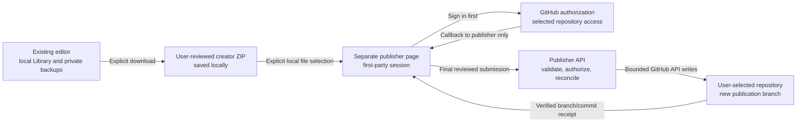

# Optional GitHub publisher design

**Date:** September 30, 2026.
**Status:** Local architecture direction approved and a bounded GH-N08
authentication simulation implemented. Production operating decisions remain
open. No live authentication service, GitHub App, domain or infrastructure
has been created.
**Parent:** [GitHub integration roadmap](./GITHUB-INTEGRATION-ROADMAP.md).

## 1. Approved direction

The owner approved planning a minimal optional hosted service and selected
**keep the existing editor URL and add a separate publishing page**.
These are architecture decisions, not provisioning or spending approval.
The owner subsequently approved a portable Node prototype using local test
providers, explicitly deferring host selection until local sizing.

The existing editor remains local-first at its current Pages origin.
Its IndexedDB Library, recovery records, player-display channel and offline
cache stay there. No domain change, redirect, storage migration or automatic
copy of local records is part of this design.

The publisher is a separate, first-party HTTPS page with its own backend.
Its first version accepts a creator ZIP that the user has already reviewed
and downloaded. It is not another editor, a cloud map library or a session
backup service. It never asks for a private project/session backup.

This deliberately adds one file-selection step. In exchange, it avoids
cross-site authentication cookies, credential relay through the editor,
cross-window message protocols and forced origin changes. A later streamlined
handoff would be a separate UX/security decision, not an implicit extension.

## 2. Why the publishing page is separate

The current implementation is a static React/Vite/PWA application:

- `vite.config.ts` builds the Pages application under `/Dungeon-Mapper/`.
- `src/service-worker.ts` precaches the static distribution and serves
  application navigations from `index.html`.
- Local projects and recovery are bound to the browser origin.
- Creator ZIP/folder creation, inspection and independent import already work
  without any account or service.

A new editor domain would not automatically have access to the existing
origin's IndexedDB data. Putting a cookie-authenticated API on an unrelated
site would also introduce third-party-cookie restrictions. The approved
separate page keeps authentication first-party without changing browser privacy
settings, requesting cross-site storage access or relying on temporary popup
cookie exceptions.

Do not put an OAuth callback under the editor's current service-worker
navigation scope. Do not change Pages DNS or the existing deploy topology
to implement this companion. Its UI/API share one origin; its service does
not register the editor's service worker.

## 3. First-version user flow

1. In the editor, review and download the normal creator package. An optional
   link can open the publisher in a new tab with `noopener` and `noreferrer`.
   No package, token, receipt capability or private filename goes in that URL.
2. Sign in to GitHub on the publisher before choosing a file. OAuth navigation
   must not require retaining a selected package across page reloads.
3. Select the ZIP locally in the publisher tab. Inspect it in browser memory,
   including member hashes, profile, licenses, source notices and previews.
   File selection alone does not upload it.
4. Choose an existing repository the user and installed GitHub App can both
   access. Show the authenticated GitHub account independently of the package's
   declared creator. Login is not proof of copyright ownership.
5. Review the exact repository, current visibility, package path, base commit,
   proposed branch and file changes. Explain possible repository workflow runs.
6. Confirm publication. Only this action sends the reviewed ZIP to the
   publisher backend for independent validation and GitHub writes.
7. Return the read-back branch/commit and a GitHub-native compare/PR link.
   A branch receipt does not mean checks passed, a PR merged or a release was
   approved.

If sign-in expires or the tab is closed, the user may need to reselect the
downloaded file. Do not persist package bytes in browser storage or upload them
early merely to hide that interruption. The original editor and local ZIP
remain usable if the publisher is unavailable.

## 4. GitHub authority and write scope

Use a GitHub App, not a user-pasted PAT or broad OAuth `repo` grant.
The user authorizes the app, installs/selects repository access where needed,
and explicitly chooses the destination. Those are distinct checks.

| Capability | Initial decision |
| --- | --- |
| Account identification | Read the authenticated GitHub user ID/login; no email-address or organization-wide access request |
| Repository metadata | Read accessible installation/repository identity, visibility, default branch and relevant package paths |
| Contents write | Request only for user-selected repositories when entering this publishing flow |
| Pull request creation | Not requested initially; return GitHub's native compare/PR page |
| Repository creation or settings | Not supported by the first publisher |
| Actions/workflow administration, branch-protection bypass, billing | Never requested by this design |
| Installation-level impersonation | Do not use an installation token to gain authority the authenticated user lacks |

GitHub grants repository-level Contents permission, not permission limited to
`maps/<package-id>/`. The backend must enforce that narrower write scope.
Repository installation and user access are rechecked server-side before
mutation; a client-supplied repository name or disabled button is not authority.
Persist numeric repository/user/installation IDs where needed, not just names.
An observed rename, transfer or visibility change requires a fresh destination
review even if the numeric repository ID remains the same.

Initial publication creates a fresh branch from the reviewed base commit in an
existing initialized repository. It never writes directly to the default branch,
force-pushes, overwrites another user's branch or merges a PR. Updating a map
means another reviewed package change on a new branch, not continuous sync.

Validate every ancestor/path and existing destination before creating objects.
Reject symlink/submodule ancestors, unexpected files, conflicting package
identity and changes outside the reviewed member list. Do not delete unrelated
files to make the destination look like a fresh package.

GitHub App actions can trigger workflows. The product must warn and obtain
explicit user acknowledgement; it must not claim to know or cap account quota.
Agent-operated tests/publications additionally follow the owner's numeric
runner-budget rules. An available public runner is not permission to ignore a
spending hold. No skip directive or workflow disabling is an acceptable shortcut.

## 5. Authentication and browser isolation

The recommended GitHub web flow uses server-side code exchange, validated
one-time state, PKCE, and a fixed registered callback. The client secret stays
server-side. Do not treat the optional `repository_id` token parameter as
sufficient authorization: the backend still checks actual accessible resources.

- Use an opaque server-side publisher session with a Secure, HttpOnly,
  host-only cookie and an appropriate SameSite policy for the top-level OAuth
  return. Do not store GitHub tokens in that browser cookie.
- Protect authenticated state-changing API requests with a session-bound CSRF
  token and strict origin checks. Callback state validation is a separate
  OAuth requirement, not a substitute for API CSRF protection.
- Strip the authorization code/state from the address after callback processing.
  Authentication responses are `no-store` and use a no-referrer policy.
  App and provider access logs must not retain callback query strings.
- Keep the publisher out of iframes. Do not use `postMessage`, opener-based
  credential transfer, service-worker caching or the editor's localStorage/
  IndexedDB as authentication transport.
- Render package descriptions/notices as inert text. Use restrictive CSP and
  frame policy; permit only the necessary local/blob worker and image paths
  after validating them. No external artwork or profile avatar is required.
- Install no analytics or body-capture middleware. Ordinary operation must not
  log tokens, cookies, codes, package content, note text or private filenames.
- Disconnect invalidates the publisher session and stops future authorized
  work. It does not delete editor data, local ZIPs or GitHub repositories.

Register revocation/installation webhooks only with validated signatures,
bounded bodies and delivery deduplication. Independently handle 401/403 responses
and removal of repository access. Revocation must not silently cause token
fallback, permission escalation or repeated writes.

## 6. Backend responsibilities and proposed interfaces

These are proposed contracts for local GH-N08/GH-N09 work, not live endpoints.
The backend is not a generic GitHub proxy and never accepts an arbitrary API
URL, token, HTTP method, Git ref or filesystem path from package content.

| Operation | Contract |
| --- | --- |
| Start authorization | Begin a user-requested, bounded OAuth transaction; no map payload |
| OAuth callback | Validate state/PKCE/session binding, exchange code, rotate publisher session and remove callback parameters |
| Session status / disconnect | Return minimal account/connection state or revoke the local session; never return GitHub credentials |
| Repository picker | Enumerate only the user's accessible app installations/repositories in bounded, user-driven pages |
| Publication plan | Authorize the selected destination and capture base identity/visibility plus intended member paths/digest; no GitHub mutation |
| Final publication submission | Authenticate/CSRF-check before body handling, receive the reviewed ZIP with a fixed transport filename, revalidate independently and bind it to the plan |
| Operation receipt / reconcile | Owner-authenticated status for one operation; reconcile uncertain provider results before any possible repeat |

Reuse the established package contract: 32 MiB ZIP, 64 MiB expanded members,
16 MiB map JSON, 256 members, supported profiles/licenses and approved image
limits. Preserve canonical members and original bytes. Do not silently shrink,
drop or relicense content to fit a hosting tier.

Server admission must cover archive/path/type/hash/schema limits independently
of the browser. A client checkbox or `rightsConfirmed` field is not server-side
authorization or proof of rights. Browser-native image/preview qualification is
distinct from backend structural validation; do not claim a server renderer
exists by reusing a DOM-dependent client function.

The server receives package bytes only after explicit final confirmation.
Authenticate and reject oversized/unauthorized requests before buffering a
body where the hosting platform permits. Platform buffering/logging behavior
must be confirmed before production use. Process payloads transiently and do
not add object storage, a persistent map database or an asynchronous map queue
for this first version.

## 7. Publication state and failure contract

Persist enough operation metadata to avoid blindly replaying an uncertain
write: authenticated owner, repository/install identity, package digest,
reviewed base, intended branch, phase and returned Git object/ref identities.
Do not store source notes or entire archives in the operation record.

Use one active mutation per destination/operation, bounded validation and
upstream request deadlines. Verify permissions and the reviewed destination
again before a write. Reject an observed change and require a fresh review.
GitHub does not provide an atomic lock across repository visibility, permissions
and separate object/ref APIs, so do not promise that those properties cannot
change concurrently.

Build the complete member tree/commit before publishing its branch reference.
The first blob request is already disclosure to GitHub, even if no branch is
ever created. Unreferenced objects may remain after failure; a cancellation
cannot undo a request GitHub already accepted.

| State | What the UI may claim |
| --- | --- |
| Reviewed locally / plan ready | No package bytes published; destination review may still expire |
| Validating submitted package | Data sent to the publisher; no claim of GitHub publication |
| Writing Git objects | GitHub may already hold uploaded objects; no branch receipt yet |
| Branch verified | The intended ref and exact resulting package bytes were read back |
| Awaiting checks / PR action | Branch exists, but checks/merge/release are not established |
| Outcome unknown | Provider response was lost or interrupted; do not report success/failure as certain |
| Failed with known outcome | Explain the confirmed phase and what may remain remotely |
| Cancellation requested | Stop future requests where possible; an accepted provider write may finish |

Use an operation identity tied to the reviewed digest/destination, not a fresh
operation for every retry click. Read back the intended ref/content after a lost
response. If an intermediate object/commit outcome cannot be reconciled, stop
for explicit recovery rather than creating duplicate writes automatically.
Do not auto-rebase, force-update, merge, rerun CI or delete remote data as recovery.

## 8. Hosting and operating decisions still needed

**Approved local prototype target:** a small portable Node service and separate
publishing UI in this repository. The test composition uses Node 24.16+ without
new dependencies. A normal Node host is a better initial
fit for the existing TypeScript/ZIP validators than assuming an edge runtime
can handle the accepted archive limits unchanged.

This is not a selected provider or approved deployment.
Avoid committing vendor SDKs, a database engine or a memory/concurrency tier
until the operating shape is agreed and locally measured. The existing Pages
build remains separate; a publisher must not be silently added to its deploy
workflow or service-worker navigation routes.

| Decision | Proposed minimum / gate |
| --- | --- |
| Provider and runtime | Portable Node/container target; actual provider remains unselected |
| State store | Durable transactional session/operation metadata with encrypted GitHub tokens; no persistent map payloads |
| Token retention | Prefer expiring user tokens and reauthorization; refresh-token retention is not approved |
| Retention periods | Propose short-lived OAuth transactions, sessions no longer than token validity, and a separately approved receipt/log retention period |
| Operating owner | Named person responsible for registration, secrets, rotation, revocation, incidents and deletion requests |
| Availability/scaling | Measure memory/CPU with accepted maximum packages; bound concurrency before admitting public traffic |
| Region and privacy | Choose location, confirm provider body/log behavior and document what temporary data the service processes |
| Cost | Approve runtime, storage/egress/domain costs separately from Actions; no free-tier or account-balance assumption |
| Deployment | Exact service/UI source, rollback, secrets/environment and applicable CI approval before any activation |

The editor's GitHub connection is not enabled by approving this document.
GH-R01 provisioning and GH-A02 service qualification remain blocked by the
unresolved operating decisions and their separate budgets. The fixture-only
24-minute ceiling cannot fund this service and is itself on an availability hold.

## 9. Local qualification and rollout boundaries

GH-N08 can only implement the owner-approved local architecture scope.
Synthetic providers belong in test composition, not a production environment
flag that could accidentally enable fake login. No real credentials or app
registration are needed for contract tests.

Required local cases include login denial, state/PKCE mismatch or replay,
session fixation, account changes, expiry/revocation, CSRF/origin rejection,
wrong installation/repository, malformed/oversized archives, path collisions,
changed base/visibility, concurrent submissions, cancellation, lost responses
and restart/reconciliation. No untrusted branch or package code is executed.

Real callback/cookie behavior needs isolated browser qualification at the
publisher origin, not disabled browser privacy settings. Verify provider
permissions and revocation against an approved test installation before
handling genuine private repositories. Mock results are not a hosted receipt.

Use existing source-pinned app/package evidence where applicable. Do not rerun
the entire editor qualification matrix for every server edit or remove its
required checks. Any new workflow/qualification policy needs explicit scope
approval and an aggregate runner budget that includes post-merge work.
Hosted agent/review jobs and runtime costs are separate resources.

Do not promote the publisher until an owner accepts its operating runbook,
privacy/permission model, measured limits, exact deployed identities and
failure recovery. If the service is delayed or discontinued, local editing,
ordinary packages, private backups and user-owned repositories remain usable.

## 10. Evidence and decisions

Source inspection: `vite.config.ts`, `src/service-worker.ts`,
`docs/ARCHITECTURE.md` and the existing creator-package/roadmap contracts.
The initial design step changed no application or deployment configuration.
The subsequent local prototype is isolated under `publisher/`; it is not part
of the Pages application or its service-worker routing.

- [GitHub App user access tokens and web flow](https://docs.github.com/en/apps/creating-github-apps/authenticating-with-a-github-app/generating-a-user-access-token-for-a-github-app):
  permission intersection, server-side exchange, PKCE/state and expiry.
- [MDN IndexedDB overview](https://developer.mozilla.org/en-US/docs/Web/API/IndexedDB_API):
  origin-bound storage. The maintained MDN source was read when the rendered
  page returned only its title.
- [WebKit third-party-cookie policy and first-party OAuth guidance](https://webkit.org/blog/10218/full-third-party-cookie-blocking-and-more/):
  avoid relying on cross-site cookies or temporary compatibility exceptions.
  This historical policy document is not a claim of current device qualification.

**Accounting:** zero hosted minutes approved/used/reserved for this design.
No GitHub registration, credential access, repository mutation, domain/DNS
change, deployment, paid-provider call, agent or new session. Provider operating
cost and account allowance remain unverified.

## 11. Local authentication prototype

The owner approved continuing with a portable local-test-provider prototype,
while leaving production hosting and operating costs deferred. The bounded
implementation lives under `publisher/` and can be run with
`npm run publisher:dev`. See [its README](../publisher/README.md) for commands
and explicit limitations.

The local server admits only a configured `http://127.0.0.1:<port>` origin and
the `local-test` provider contract. Its only concrete provider creates synthetic
authorization codes, tokens, identities and repository metadata in memory.
The UI and response metadata prominently identify simulation mode. No real
credentials or GitHub endpoints are configured or read.

This slice implements state/PKCE and single-use callback handling, session and
CSRF rotation, expiry, Host/origin checks, bounded bodies/session count, response
deadlines, repository-access denial, disconnect/revocation and obsolete callback
protection. It cannot resurrect a disconnected session with a late exchange or
clear a newer session because an older provider request failed. Callback error
pages remove code/state from their address when the local UI initializes.

The browser page uses native first-party fetch and cookies. Only opaque session
IDs enter cookies; synthetic provider tokens remain server-side. Local browser
storage/IndexedDB stay empty. The HTTP test cookie is deliberately not Secure,
and cookie isolation by port is not promised. **Production TLS, host-only Secure
cookies, real GitHub callbacks and provider privacy behavior are not qualified.**
Do not deploy this test composition or treat it as a public service.

Twenty local HTTP tests cover positive and negative protocol cases, including
a deliberately non-settling provider and the actual ten-second response
deadline. The native-browser probe covers denial, session rotation, wrong-CSRF
rejection, callback replay, clean callback addresses, disconnect, account
changes, revocation and narrow-layout readability on all three locked engines.
The first browser attempt used a protocol response-body read after navigation
and failed as a test harness issue. The corrected probe records cloned native
fetch responses before handing them to the client; no response-timing claim is
made.

Initial browser evidence is retained in the session's
`files/github-publisher-browser-initial/` and
`files/github-publisher-browser-capture/`. The latter records exact source
hashes and simulation/cookie limitations. Final source-linked receipt locations
are recorded at closeout rather than inferred from an earlier successful run.

Root lint and the standalone publisher type check pass. The editor rebuild was
compared with `github-version-comparison-dist`: all 22 production files remained
byte-identical. The existing App chunk-size advisory remains visible; no
renderer, editor origin, private storage or release workflow changed.

The prototype does not implement package submission, server package validation,
durable/encrypted credentials or operation receipts, real repository discovery,
webhooks, GitHub branch writes or PR actions. No production provider, operating
owner, retention schedule, service capacity or operating budget is selected.
Authentication-body tests cannot size future large package processing.
GH-N09 publication simulation and all live operating/qualification gates remain
separate work.
