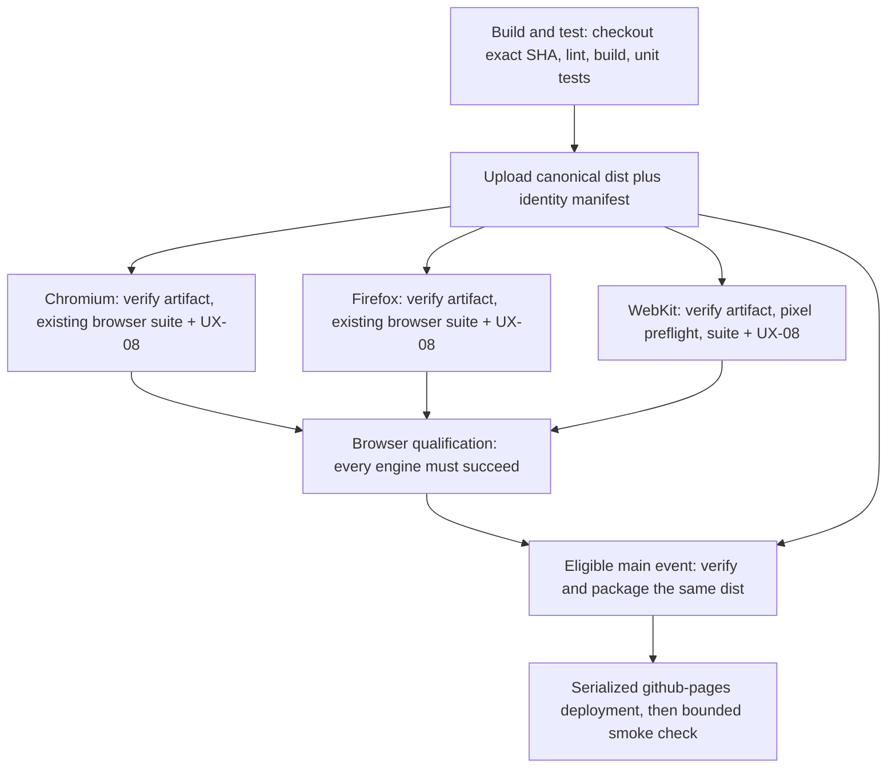

# Exact-revision Pages deployment design

**Status:** Core local implementation approved explicitly September 28, 2026.
The owner selected "Approve local implementation" while retaining zero hosted
minutes and prohibiting pushes, hosted runs and remote-setting changes.
Implementation is locally committed; [validation and remaining limits](./UX-09-HANDOFF.md#local-exact-artifact-deployment-implementation)
are recorded separately. Remote workflows, branch/environment settings and
account configuration are unchanged. This is not hosted or release evidence.

The design below preserves the original rationale and acceptance targets.
Workflow topology, canonical artifact reuse, replacement of independent
deployment paths and job-level cancellation are approved for local implementation.
Durable release retention, any additional human environment approval and a
numeric hosted budget remain separate decisions.

**Baseline:** Local source `2e18fcb`; remote main `72f32e1`; PR #185 remains at
`dbba27f`. Read-only inspection confirmed the configuration below. Refresh it
before implementation or publication rather than treating this snapshot as live.

## Observed baseline gap and preserved policy

At the inspected remote baseline, `.github/workflows/deploy.yml` builds and publishes independently on main pushes
or manual dispatch. It does not depend on that revision's CI. The last successful
Pages run, `35034579361`, published source `72f32e1`; its successful result alone
does not establish release acceptance.

The active default-branch ruleset, `Protect default branch` (21362094), requires
a PR and strict/up-to-date **Build and test** and **Browser qualification**.
The `github-pages` environment allows branch `main`; its observed protection is
a branch policy, not a required reviewer or successful-CI gate.

Preserve both required check names and their fail-closed behavior, all three
browser engines, zero-warning lint, the full existing suites, UX-08 and the
WebKit pixel preflight. Do not change test thresholds, add paths-ignore filters,
introduce paid runners, bypass protection or promote the new manual A-UPDATE
rehearsal into required CI as an incidental part of this change.

Pages remains a development preview. Technical qualification before deployment
does not approve early access: all remaining A gates, owner decisions and
accepted support limits still apply to a release announcement.

## Recommended topology: one qualified artifact in one workflow

Prefer dependencies within `ci.yml` over a privileged `workflow_run` deployer.
There is no need to infer success from a different workflow, search for a
"latest successful" artifact, or rebuild code after qualification.

| Job | Proposed responsibility |
| --- | --- |
| `build-and-test` / **Build and test** | Keep Node 20, locked install, lint, production build and unit tests. After successful checks, produce one canonical distribution and manifest. Expose its artifact ID, manifest hash, actual checkout SHA and run/attempt identity as job outputs. |
| `browser-journeys` | Depend on the successful build. Keep each engine's checkout, dependency/browser setup and current commands, but replace its production build with a download of the exact canonical artifact ID. Verify identity and files before and after tests. Do not rebuild or mutate the distribution. |
| `browser-qualification` / **Browser qualification** | Keep `always()` and require the complete matrix result to be `success`. A failed, missing, skipped or cancelled required engine is not accepted. Evidence upload failures still fail their engine job. |
| Proposed `package-pages` | Depend explicitly on Build and test and Browser qualification. Only eligible main events may proceed. Download and verify the canonical artifact, then run the Pages packaging action on `dist` only, without another install or build. |
| Proposed `deploy-pages` | Depend on successful packaging and qualification. Use the existing `github-pages` environment and deploy action. Publish the uniquely named Pages artifact from this run/attempt, not a branch lookup or artifact from another run. Record the deployment result and bounded public-file smoke result separately. |

The current renderer specs compile their diagnostic modules with `write: false`.
UX-08 serves its controlled worker through middleware. Neither requires replacing
the production distribution. Keep those diagnostic builds: removing them would
remove assertions, not merely duplicate production compilation.

The original independent `deploy.yml` push and dispatch paths are removed
together in the local implementation. Leaving either path active would preserve
the bypass. They remain active on the remote baseline until the implementation
is budgeted, published and merged.
No cross-run artifact promotion or reusable privileged deployment service is needed.

Deleting the file does not apply new guards retroactively to historical runs.
GitHub reruns retain the original SHA/ref and triggering actor's privileges.
The cutover must also account for queued and still-rerunnable legacy deployments;
otherwise an old main run can remain outside this new graph. Owner authorization
is needed for any server-side legacy-workflow disablement or other publication
restriction, and its actual rerun limitations must be verified rather than
assumed. No remote restriction was changed in this local-only task. Until
cutover is resolved, do not claim repository-wide enforced publication gating.

## Artifact identity and failure behavior

Use a small manifest beside, not inside, `dist`. It records the actual checkout
SHA, repository identity, event/ref, lockfile hash, tool versions, workflow run
ID/attempt and a sorted list of relative distribution paths, lengths and SHA-256
hashes. Reject missing files,
extra files, symlinks/hard links and escaping paths. Bind the manifest's own hash
to the producer job output. Do not execute artifact-provided shell scripts or
build hooks during integrity checking or deployment. Browser journeys still
load the application assets they are intended to test.

Name the canonical artifact with run ID and attempt, and consume its immutable
artifact ID. Use similarly unique Pages/evidence names for reruns. Every consumer
must match the source, run, attempt and manifest hash to its expected job context
and recompute file hashes with a nonzero exit on mismatch. GitHub's automatic
download digest check can emit only a warning; it is not the sole integrity gate.

PR qualification uses the actual tested merge SHA, not just the PR branch tip.
Main qualification uses the exact main commit. Pin browser checkouts to the
producer SHA; do not resolve a moving branch again. Existing journey attachments
and qualification artifacts should include the canonical manifest identity rather
than a separate competing evidence system.

The Pages archive has a different container format from the canonical artifact.
The invariant is identical **distribution file bytes**, not identical ZIP/tar
wrapper hashes. Package only the verified `dist`; do not publish manifests,
traces, synthetic recovery files, source archives or persistent browser profiles.

A partial job rerun can mix successful jobs from an earlier attempt with a new
attempt. Fail identity validation rather than accepting that mixture. The initial
design requires a **whole-workflow rerun** after diagnosis and budget approval,
including for a deployment-only failure. An optimized replay of a previously
qualified artifact would be a separate, explicitly approved policy.

## Events, permissions and concurrency

Deployment eligibility is the conjunction of:

- Repository is `evillollive/Dungeon-Mapper`, not a fork with a similarly named
  main branch.
- Event is a push to `refs/heads/main`, or an explicitly requested full CI
  `workflow_dispatch` on `refs/heads/main`.
- Build and test, every browser job, Browser qualification and packaging succeeded
  for the matching source/artifact/run/attempt.
- The actual deployment candidate still equals main immediately before submission.

PRs, fork PRs, tags and off-main manual validation never receive a deployment
path. They still run the existing required checks. An intentionally unpublished
PR is not a failed test, but it is also not deployment evidence. Do not add an
arbitrary-ref, artifact-ID override or "skip qualification" dispatch input.

Keep ordinary jobs read-only. Grant `pages: write` and `id-token: write` only to
the deployment job; retain the main-only environment policy. Use only the read
permissions needed for source/artifact checks elsewhere. Do not add a PAT,
`pull_request_target`, environment secrets or account-setting changes.

Moving deployment into CI makes the existing workflow-wide cancellation unsafe
for an in-flight deployment. Proposed replacement:

- Cancellable job-level groups for Build and test and each browser engine, keyed
  by workflow/ref/job and, for the matrix, engine. Superseded work remains
  unqualified; dependent jobs cannot treat cancellation as success.
- A repository-wide Pages deployment group with `cancel-in-progress: false`.
  Do not retain an outer workflow-level cancellation that can still terminate
  this deployment. Superseded pending deployments need not be preserved.
- Recheck main after acquiring the deployment slot. If the candidate is stale,
  record "not published: superseded" and stop without a Pages call.

This reduces superseded work without assuming dispatch order equals deployment
order. A newer main commit can arrive after the final check: the in-flight
publication remains qualified but can briefly lag main. This is not an atomic
"always latest" guarantee. Manual cancellation or a timeout also cannot undo a
Pages request already submitted; resolve its actual server-side status before
another deployment rather than assuming cancellation rolled it back.
Do not describe job concurrency as a durable lock on GitHub's external service.
Uncertain server-side completion is an operational hold requiring an owner to
withhold further publication until resolved, not an automatic rollback feature.

Keep existing qualification job timeouts. Propose explicit limits of five minutes
for packaging and ten for deployment plus its bounded smoke check, subject to
implementation approval. These timeouts are not an account spending cap.

## Publication, smoke checks and rollback

The deployment job records source SHA, canonical artifact ID/manifest hash, run
and attempt, Pages artifact identity, deployment URL and available server-side
deployment identity/status. A successful action followed by a failed smoke check
means **published but unverified**, not "nothing was deployed."

After deployment, use bounded read-only HTTP checks of the entry HTML, worker and
referenced production files against the canonical hashes. Allow a documented,
limited CDN propagation window within the deployment timeout. Do not loop until
green or create another deployment automatically. Stop on mismatch/timeout and
retain the results. Existing clients may still run an older worker until they
choose Update saved workspace; a public HTTP smoke check does not prove that all
open browsers updated.

Default code rollback is a reviewed revert of the product change onto current
main, preserving this qualification/deployment machinery and strict checks.
That new commit needs full qualification and its own budget. Do not force-push
main, resurrect the old independent deploy workflow or dispatch an arbitrary
historical artifact.

Code rollback must not roll back user storage. Preserve project backups,
separately saved sessions and retained originals; do not clear site storage.
The local `72f32e1 -> d9036c5 -> 72f32e1` rehearsal is evidence only for that
unchanged-schema pair. Final-candidate/support scope and rollback compatibility
must be resolved before a release. There is no dedicated session-file importer.

Before formal release, retain a versioned evidence/limitations summary and the
selected synthetic evidence/build archive beyond Actions' fourteen-day window.
Recommend an owner-approved release archive, not publishing test evidence on
Pages or extending every CI artifact indefinitely. Storage location, retention
and release publication require an owner decision; this design does not create
a release or close that part of A-RELEASE.

## Acceptance and implementation boundary

These are proposed checks, **not executed results**:

| Scenario | Required outcome |
| --- | --- |
| Full successful eligible main run | Exactly the artifact consumed by all three engines is packaged and eligible for publication; deployment and smoke outcomes are retained |
| PR or off-main dispatch succeeds | Qualified validation only; no Pages write permissions or deployment |
| Build, any engine, UX-08, preflight or required evidence upload fails | No Pages publication; aggregate remains fail-closed |
| Required job skipped/cancelled or artifact absent/expired | No publication and no substitution with an older "green" run |
| Dist or manifest tampered with, wrong SHA/run/attempt, extra file or unsafe path | Explicit verification failure before tests/packaging/deployment, as applicable |
| Failed-job-only or deploy-only rerun | Reject mixed-attempt evidence; require an approved complete rerun |
| Old successful run becomes eligible after main advances | Recheck under the Pages slot and decline stale publication |
| New push arrives during deployment | Do not cancel the active Pages request; the next publication must qualify independently |
| Deployment API result is uncertain or smoke fails | Record unknown or published-but-unverified state, preserve evidence and stop; no automatic rollback/retry |

After explicit implementation-scope approval, local work can author the workflow
and small manifest verifier, exercise positive/negative synthetic verification
cases, and inspect the job graph without hosted minutes. Validate failure paths
locally first; simulated job results are not GitHub enforcement evidence.

A later budgeted PR run must preserve both required check names and all existing
qualification. A budgeted post-merge main run must demonstrate the artifact chain,
environment restriction, deployment and smoke receipt. Do not merge the design
as if those results already existed. Rollout should batch the topology change and
removal of the independent path, with no temporary ungated fallback.

## Cost and explicit decisions

The proposal reduces a PR's production builds from four to one, and main's from
five to one. Browser jobs still need their own dependency/browser installations
and diagnostic compilation. Artifact uploads/downloads, hashing and packaging
add work and storage. Matrix startup waits for Build and test, so elapsed time
may increase even if aggregate build work decreases. Measure actual authorized
runs before claiming a net minute saving.

Use the [existing observed job totals](./UX-09-HANDOFF.md#zero-actions-roadmap-disposition-and-resume-checklist)
as planning evidence: about 35 rounded minutes for the current full PR CI run,
not its approximately 11.5-minute elapsed time. Until measured, retain the
70-80-minute planning range for one update plus post-merge CI/Pages, before
retries, rather than discounting anticipated savings. Whole-workflow retries
must include every leg and repeated setup. Refresh triggers, durations, billing
rules, storage/cache implications and queued work before proposing a conservative
numeric ceiling. Account quota and billed resource usage are unknown.

Owner decision disposition:

- Approved for local implementation: topology, canonical artifact reuse,
  replacement of independent deployment paths, job-level cancellation and
  main-only full manual reruns. Hosted enforcement remains unverified.
- Choose durable release-evidence retention and whether a future formal release
  needs additional human deployment approval. The current environment has none.
- Authorize the legacy-workflow cutover handling needed to prevent old deployment
  definitions from being reused outside this graph. Local file deletion is not
  evidence that historical runs are revoked.
- Separately approve a numeric hosted budget before any push, dispatch, rerun or
  merge. Design approval and allowance resets grant no minutes.

This documentation task initiated **zero hosted triggers** and made no remote
mutations. Local documentation work and read-only metadata/documentation fetches
are not a hosted qualification receipt.

## Provider references checked September 28, 2026

- [Custom Pages workflows and required deployment permissions](https://docs.github.com/en/pages/getting-started-with-github-pages/using-custom-workflows-with-github-pages)
- [Immutable workflow artifacts and digest validation behavior](https://docs.github.com/en/actions/tutorials/store-and-share-data)
- [Workflow/job concurrency and cancellation](https://docs.github.com/en/actions/how-tos/write-workflows/choose-when-workflows-run/control-workflow-concurrency)
- [Historical reruns retain the original SHA, ref and actor privileges](https://docs.github.com/en/actions/how-tos/manage-workflow-runs/re-run-workflows-and-jobs)

Provider examples can show newer action versions than this repository. Verify a
compatible upload/download/Pages action combination when implementing; do not
bundle unrelated action or dependency upgrades merely to copy an example.
