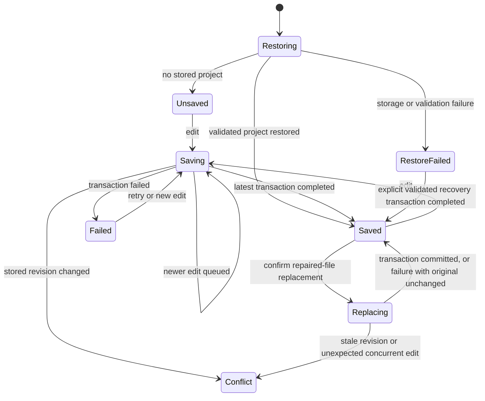

# UX-01A: save trust and compatibility foundations

**Baseline:** `fbbfb2b`, including UX-00 PR #157.

**Scope:** Bounded UX-01A implementation with an owner-requested follow-up for explicit fog repair and named destructive-action checkpoints. This is not completion of UX-01 or authorization to start UX-02. UX-00 participant research remains explicitly deferred by the owner, with zero participants. UX-09 qualification gates are unchanged.

## Schema and migration

`src/utils/projectSchema.ts` exposes schema version **1**, `decodeProject(unknown)`, and `encodeProject(project)`. Portable backups use `{ schemaVersion: 1, project }`; the device adds `storageRevision` outside the project payload.

The decoder accepts a versioned envelope, an unversioned multi-level project, or a legacy bare map with `tiles`. It preserves unknown project/map/asset fields, promotes libraries carried by bare maps without removing their original fields, and validates nested arrays, enums, finite numbers, dimension/grid agreement, token footprints, and level-link indices. Existing custom themes, stamp images/SVG definitions, templates, room shapes, rivers, fog, annotations, and links remain project content. Note descriptions are unchanged; visibility migration remains UX-05.

Decoding does not mutate the original. Missing legacy optional fields remain absent in the portable payload, except that missing stair links become an empty array; existing editor defaults are applied when opening the validated project. Unversioned IndexedDB records are upgraded on their next successful save, with their prior value retained as `previous-save`. localStorage migration commits once and retains the source bytes.

Validation allows legitimate off-grid notes, rooms, vectors, markers, and stair cells retained by existing resize behavior. Standard decoding still rejects mismatched `fog` or `explored` grids. **Explicit repair:** `previewFogRepair()` prepares a separate validated project and a per-level/per-layer summary of old/new dimensions, added cells, and excluded cells. It accepts only non-empty rectangular boolean grids with a dimension mismatch; ragged/non-boolean grids, unrelated invalid fields, and future schemas remain rejected. New cells are covered in static fog and unexplored in explored memory. Other project content is unchanged.

Use **Review fog repair** after a failed device restore, or **Recovery copies > Review a fog repair file** for a legacy file. Preview and cancellation perform no writes. Confirmation commits before opening the repaired project. A stored original is retained in the same CAS transaction; for a selected file, the file itself is never modified, its raw content remains downloadable from the preview, and the current device project is checkpointed. A competing revision or quota failure keeps the preview available and does not open the repaired candidate.

## Storage and save contract

The existing IndexedDB database `dungeon-mapper`, version 1, and `maps` object store are retained. This is still one active `autosave`, not a project catalog.

| Key | Contents and retention |
| --- | --- |
| `autosave` | Versioned project envelope with a unique `storageRevision` for optimistic concurrency. |
| `previous-save` | The complete prior committed autosave, replaced on each successful save. |
| `replacement-recovery` | Up to five previous committed projects retained for replacement, generation, clear, resize, level deletion, template application, or explicit recovery. New entries include a reason. Ordinary subsequent edits do not evict these copies. The next checkpoint beyond the limit evicts the oldest checkpoint. |
| localStorage `dungeon-mapper-autosave` | Original legacy bytes retained after migration. Migration only runs if IndexedDB has no autosave. An existing IndexedDB project always takes precedence. |

`src/utils/storage.ts` provides:

- `loadProject(): Promise<{ project, revision }>`: validates before returning a project. Absence is distinct from failure. Unsupported or invalid data throws `RestoreError` with the original value and expected revision.
- `saveProject(project, expectedRevision, checkpoint?): Promise<string>`: validates, reads the current revision, retains recovery data, and writes in one readwrite transaction. `checkpoint` accepts a boolean or a named action reason. Resolves only on transaction completion. An aborted transaction, including one whose put request succeeded first, is a failure.
- `loadRecoveryRecords()`: reads local copies for download, including original localStorage data. Unreadable recovery metadata is reported rather than rendered or silently discarded.
- `downloadRecoveryData()`: downloads the original object as JSON, or preserves original localStorage text exactly.

All connections close when their transactions finish. A blocked open reports an actionable error; a late successful connection after that failure is closed. Database version changes close existing connections.

`src/utils/saveCoordinator.ts` serializes writes within an editor and coalesces queued edits to the latest project. Newer edits cannot be marked saved by completion of an older transaction. Revision comparison in the transaction prevents stale cooperating tabs from automatically overwriting each other. Conflicts stop retry and automatic writes; edits remain in memory and can be exported.

Its `replace()` path commits a repaired-file replacement against the current revision before opening it. The editor becomes inert and global shortcuts pause during that transaction, while save/recovery feedback stays accessible. A failed transaction restores the unchanged prior save state and surfaces the repair error; a revision conflict stops automatic writes. If an unexpected internal edit arrives during replacement, that newer in-memory work is preserved and a conflict is surfaced rather than discarding it.



## User-facing behavior

`SaveHealth.tsx` exposes Restoring, Not saved yet, Saving, Saved on this device, Save failed, and Save conflict. Offline is an independent indication, not a save failure. Existing editor layout and commands are retained, with a compact save/recovery strip rather than a redesigned shell.

The editor and its global shortcuts are unavailable until restore succeeds or reports an empty store. Failed restore never exposes a fresh editable blank map that could overwrite the original. The failure screen offers retry, original-data download when available, recovery-copy downloads, and an explicit recovery-file import when the original revision is known. That import validates before asking to replace; it retains the unreadable original in the same transaction, then opens the recovered project only after commit. A stale revision, invalid file, or storage failure leaves the original intact.

New/import/sample replacement, current-level generation, selected-region generation, clear, resize, level deletion, and scene-template application are paused while saving, after save failure, or during conflict. This prevents those actions from discarding newer in-memory work that has not committed. A saved predecessor is checkpointed when the resulting save commits. Until then, the original remains the active persisted record. Blocked generation/template actions keep their dialogs open and do not announce success.

Clear and generation confirmations identify the current-level scope; level deletion identifies its affected stair links. Other levels remain intact. Resize now also creates a memory undo snapshot. This is a bounded pre-change checkpoint policy, not persisted undo for every edit.

Backup controls explicitly warn that editable files include DM-only content. Save failure leaves Export backup and Retry save available; conflict leaves backup export available without permitting blind retry. The browser receives a before-unload warning while work is unsaved, failed, or conflicted, but browser termination can still bypass that warning.

Map dimension selects now include the actual loaded dimension, not only fixed presets. A 40 x 40 sample and other valid non-preset dimensions display truthfully without causing a resize. Resizing also resizes explored fog memory alongside static fog.

## Recovery and compatibility limits

These are bounded local recovery copies, not a full durable history or an external backup. Browser storage deletion, device loss, storage eviction, or quota exhaustion can defeat local recovery. Undo remains memory-only and is not restored on reload.

Only successfully committed predecessors can be retained. Debounced work lost through a forced tab/process termination is not promised durable. An unsaved blank project is not labeled saved merely because the application loaded. Ordinary painting, clipboard edits, and individual/per-layer deletions still use the previous-save copy and memory undo, not named checkpoints for every action. There is no browsable version-history manager or general restore preview; the new preview is specifically for fog-dimension repair.

Revision protection requires clients using the new repository contract. Already-open older application versions cannot be retroactively made cooperative; close older tabs before using the updated application. The new client detects a changed legacy record instead of blindly overwriting it.

Recovery imports preserve originals locally but can fail if there is insufficient space to keep both. Export original and in-memory backups before clearing any browser data. No cleanup of legacy bytes is automatic.

## Developer evidence

Run on September 7, 2026, against this worktree:

```sh
npm run build
npm test -- src/utils/__tests__/projectSchema.test.ts src/utils/__tests__/projectRepair.test.ts src/utils/__tests__/exportProjectJSON.test.ts src/utils/__tests__/saveCoordinator.test.ts src/hooks/__tests__/savePersistence.test.tsx src/hooks/__tests__/mapStateUtils.test.ts src/hooks/__tests__/mapStatePerformance.test.ts src/hooks/__tests__/mapStateRivers.test.ts src/components/__tests__/saveTrust.test.tsx src/components/__tests__/uiBehavior.test.tsx src/components/__tests__/dialogs.test.tsx src/utils/__tests__/exportRender.test.ts
```

The follow-up production build succeeded; 160 cases across twelve targeted files passed. Changed-scope ESLint reported no errors and nine pre-existing dependency warnings in `useLevelManagement.ts`, reproduced against the previous committed version. Build retains the existing large-chunk warning. jsdom reports unsupported document navigation from download-link exercises; those cases pass and actual browser download events were also exercised. The initial slice had 120 cases across nine files.

Schema fixtures in `projectSchema.test.ts` include a minimal bare map, a full multi-level project with custom assets and every current layer, every bundled sample, invalid nested fields, future versions, unknown fields, migration idempotence, and portable JSON round trips. Coordinator cases deliberately hold a transaction pending while newer edits arrive, then assert that only the latest committed state becomes Saved.

CI on `1587a21` exposed the existing module-size guardrail: `useMapState.ts` was 1,417 lines against a 1,400-line limit. The pure resize transformation was extracted into `mapStateUtils.ts` as `resizeMapContent`, keeping the hook responsible for checkpoint/history/save orchestration. The hook is now 1,388 lines; the limit and formatting policy are unchanged. Two direct resize regressions were added, and the targeted guardrail, state-utility, and persistence suites passed all 46 cases. Production build and extraction-scope lint also passed.

Persistent browser regression script: `src/test/saveTrust.browser.js`. Start the existing dev server with `npm run dev -- --host 127.0.0.1 --port 5191 --strictPort`, then execute that file through Playwright MCP `browser_run_code_unsafe`. The script creates and closes fresh contexts, never uses existing personal browser storage, and completed twelve scenario groups:

- Native IndexedDB migration/revision/replacement and transaction-abort cases.
- Unsupported/malformed data retention and a simulated blocked-open event.
- Visible save status and project reload.
- Two real tabs with stale-write conflict and retained in-memory work.
- Simulated quota exhaustion, backup availability, and successful explicit retry.
- Local saving while an already-loaded editor is offline.
- Failed-restore UI, raw download event, invalid recovery-file rejection, successful recovery import, 40 x 40 selects, and retained original after reload.

Quota exhaustion is injected at IndexedDB `put`; blocked open is a synthetic blocked event. These are not real device exhaustion or a live database-version upgrade. The offline case is not an offline cold-start or production service-worker qualification. The existing development manifest-path error remains outside this slice. The Python browser helper was absent, so the available Playwright MCP was used without adding dependencies or a new test runner.

The additional `src/test/recoveryChanges.browser.js` function uses the same server and tool, with a fresh context. Five further scenario groups passed: cancel/confirm clear with other-level preservation and a full checkpoint surviving later edits/reload; five-copy retention under native transactions; fog repair preview/cancel/quota failure/retry and exact original retention after reload; a second tab writing between preview and confirmation; and a repaired legacy-file import. The original twelve browser groups were rerun successfully after integration.

## Remaining UX-01 gates

- Broader persisted history/recovery management and general restore previews, beyond one previous save and five named pre-change copies.
- Broader invalid-data diagnostics or repair beyond the supported rectangular fog-dimension mismatch; no speculative repair of unrelated corruption.
- UX-01B project-record identity and non-destructive switching foundations, before UX-02 Library work.
- Expand fixtures and browser qualification for supported browsers, reload/offline failure journeys, and retention/quota behavior at realistic project sizes.
- Preserve all existing exports, deterministic generators, assets, and shortcuts through those additional slices.

No authored-versus-session-progress separation, note-visibility migration, player projection, remote interaction, Library, or production art redesign is implemented here.

## Rollback

Before switching to an older application, download editable backups and any original/recovery records needed. Do not assume old builds understand the versioned envelope. Work on copies when extracting the `project` payload for an older build, and keep the original versioned file. Rolling back code is not authorization to delete IndexedDB or localStorage.
