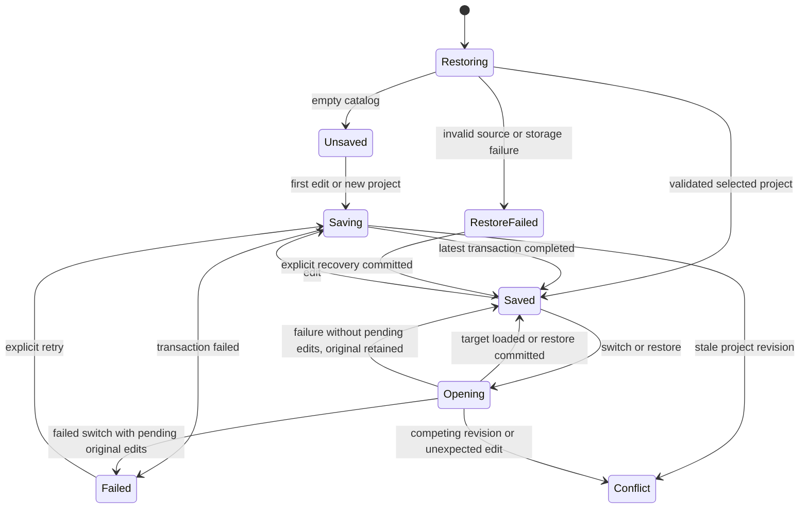

# UX-01: project identity, save trust, and recovery foundations

**Baseline:** `34f09851959a7fd5aa5d5818e52276af60dac5b5`, merged #158.

**Status:** Follow-up implementation for review, not a declaration that UX-01 is complete. The owner authorized the remaining UX-01 foundations. Parent coordination owns final review, broader qualification, and merge. UX-00 participant research remains explicitly deferred with **zero participants**. UX-09 release gates are not waived.

## Current architecture

The existing IndexedDB database `dungeon-mapper`, version **1**, and `maps` store remain. No database-version upgrade is required. Project content remains portable schema **1**. No authored/session split or visibility migration is introduced.

| Key | Contract |
| --- | --- |
| `project:<UUID>` | One local project record: `{ schemaVersion, project, storageRevision, localProjectId, createdAt, updatedAt }`. |
| `project-migration-v1` | ID of the project migrated from the former single autosave. Created in the same transaction as that project. Not a shared active-selection setting. |
| `previous:<UUID>` | The complete prior committed record, rotated on each successful save of this project. |
| `recovery:<UUID>` | Up to 20 explicitly retained checkpoints, each with an ID, project ID, timestamp, reason, and complete predecessor data. |
| `autosave`, `previous-save`, `replacement-recovery` | Retained legacy archive. Migration does not rewrite or delete these keys. Accessible through Recovery copies. |
| localStorage `dungeon-mapper-autosave` | Original bytes retained verbatim, including whitespace. Used as migration input only when IndexedDB `autosave` is absent. |

Local identity is a generated UUID outside the portable payload. It does not depend on project name, level names, or imported IDs. Project names edit `DungeonProject.name`; map names still edit the current level's metadata. Imported `id`, `sourceProjectId`, and other portable extension fields are preserved as content/provenance, never used as local repository keys. This slice does not introduce a new portable identity schema or claim a cross-device identity registry.

New, import, and sample paths allocate separate local IDs. Repeated imports of the same backup cannot alias each other. Prior projects remain in the chooser rather than depending on a rotating replacement archive. Creating a new project is initially an in-memory action with a queued first save; it is not labeled saved before transaction completion. A failed first save retains the candidate in memory and leaves all earlier project records intact.

The current selection is `?project=<local ID>` in the tab's URL, updated after successful initialization/save. Reload restores that selection. Another tab's selection cannot change this tab. Without a selection URL, startup uses the migration project or an existing catalog record, or creates an unsaved blank candidate when the catalog is empty. The browser Back button is not a project-navigation history in this slice.

## Migration and repository API

`src/utils/projectRepository.ts` owns catalog loading, migration, recovery listing, and explicit checkpoint deletion. `src/utils/storage.ts` retains the shared database lifecycle and save transaction.

- `loadProject(projectId?) -> { project, revision, projectId, checkpointCount }`: validates before opening the editor. Missing, unsupported, or invalid selected records produce retained-source diagnostics rather than an editable blank replacement.
- `saveProject(project, expectedRevision, checkpoint?, projectId?) -> revision`: validates and compares the expected revision, stores the previous record/checkpoint, and writes the project in one readwrite transaction. An explicit ID addresses that project only. The optional no-ID path is the historical single-autosave compatibility API, not the application writer.
- `listProjects()`: minimal catalog summaries with original values and per-record diagnostics. Invalid records remain downloadable, not hidden or silently repaired.
- `projectRecoveryRecords(projectId?)`: current-project copies plus the legacy archive and original localStorage bytes. Invalid recovery metadata is surfaced with its retained source.
- `recoverLegacyProject(project, expectedRevision)`: commit-gated recovery of an unsupported/invalid legacy source. Creates the new project and migration marker atomically, retains the original source unchanged, and rejects a competing migration or changed source revision.
- `checkpointCount(projectId)`: reads capacity for preflight. Malformed lists are errors, not silently reset.
- `deleteCheckpoint(projectId, checkpointId, expectedData)`: transactionally compares the selected checkpoint's ID and source before removing only that checkpoint. Missing/changed copies conflict. This API cannot delete projects, legacy archives, or localStorage originals.
- `downloadRecoveryData(data, filename?)`: downloads objects as JSON or original strings verbatim. Its attached download link is removed after use; the object URL stays alive for 60 seconds so the browser can consume it. Editable project export uses the same delayed-release policy.

Migration compares and writes inside one transaction, including its marker. Concurrent migrations resolve to one project identity. A put/add request succeeding is not success if its transaction later aborts. A failed migration leaves both source and catalog unchanged and keeps the editor blocked. Retrying is idempotent.

Database connections close on completion/abort and on version changes. Blocked opens report an actionable error and close a late successful connection. An older client can still write the legacy archive, but cannot automatically overwrite an already migrated project record. Close older application tabs and export backups before rolling back.

## Save coordination and switching

`SaveCoordinator` serializes writes and coalesces pending edits. Only the latest completed transaction can produce Saved. Each editor keeps its own local ID and expected revision. Same-project stale writes stop automatic saving/retry and retain in-memory work; different projects can save independently.

Switching requires a clean, non-writing editor and pauses editing/global shortcuts while the target loads. A failed target read leaves the prior project and revision selected. A newer edit arriving during a successful switch blocks activation with a conflict. A newer edit arriving during a failed switch is explicitly Failed, not falsely Saved, and can retry against the original project.

`useProjectDispatch` associates editor mutation callbacks with a coordinator generation. New projects, successful switches, and restores invalidate prior callbacks. A late upload callback from a prior project reports that it was not applied rather than writing into the newly opened project. Selection, pending stair-link selection, canvas gestures, and memory undo reset across these boundaries.

Recovery of a healthy current project uses `replace()`: validate, require clean state/capacity, write and retain the predecessor with CAS, then hydrate the editor. Quota failure leaves the prior content and preview available. Conflict stops automatic writes. Recovery after a failed initial project restore uses the retained expected revision and the same project key.

## Recovery management and retention

**Owner-approved policy:** pause for explicit cleanup at **20 durable checkpoints per project**. Ordinary edits must continue saving. Named destructive-action guards check capacity before mutating the in-memory map, and the repository rechecks in the CAS transaction. Cleanup refreshes coordinator capacity. This changes the old five-copy silent rotation policy only for new project records; legacy archives remain untouched.

Named checkpoints cover clear, full-level generation, selection generation, resize, level deletion, scene-template application, explicit fog repair, and general recovery restore. Each snapshot is whole-project scope, even when its reason names a current-level action. New/import/sample do not need replacement checkpoints because the prior project itself remains saved.

Recovery copies offers metadata and validated whole-project previews with project title, every level's actual dimensions and note/token counts, and asset-library counts. Cancel does not write. Restore replaces all current project contents while preserving its local ID and retaining its committed predecessor. Failed/quota/conflict restores keep their preview/source available. Preview files are never modified.

Checkpoint deletion requires explicit confirmation and targets the selected checkpoint only. The UI warns to download first. At capacity, the message routes users to Recovery copies for cleanup; it does not discard the oldest copy or attach a doomed checkpoint to an ordinary edit. A concurrent writer can still invalidate a previously clean revision; CAS then stops the action's save rather than silently overwriting.

Backups and previews explicitly warn about DM-only/private content. Original data, current in-memory work, prior saves, checkpoint records, and legacy sources remain downloadable. Invalid/future records provide diagnostics and raw-source export. No unrelated corruption is inferred or silently repaired.

**Durable versus memory-only:** checkpoints and the rotating previous-save slot survive reload only after their transactions commit. Undo/redo remains per-level memory history and resets on project switching, new/import/sample, or restore. Ordinary painting, clipboard operations, and individual layer deletions do not create unbounded persistent undo. Forced termination can lose debounced edits. Browser data deletion, eviction, device loss, and quota exhaustion can defeat local recovery; device copies are not external backups.

## Compatibility retained

The decoder accepts versioned v1 envelopes, unversioned multi-level projects, and bare legacy maps with `tiles`. Nested unknown project/map/asset fields, custom themes, stamp definitions/images, templates, every current layer, and existing note descriptions remain portable content. A project-level `schemaVersion` extension is interpreted inside an explicit envelope rather than confused with the envelope version.

Fog repair remains explicit and limited to nonempty rectangular boolean `fog`/`explored` grids whose dimensions disagree with valid tiles. It preserves intersection cells, adds covered static fog/unexplored memory, and reports added/excluded cells per level/layer. Ragged/non-boolean grids, unrelated corruption, and future schemas are rejected. The original is retained before the repaired project opens.

Dimension selectors continue displaying actual loaded values, including 40 x 40 samples and non-preset sizes. Resize covers explored memory. No generator, PNG/SVG rendering, print, player visibility, offline architecture, or asset behavior is intentionally redesigned.

## Evidence and qualification boundary

This follow-up uses existing Vitest, TypeScript/Vite, ESLint, and the available external Playwright SDK, without new dependencies or changed guardrails. `useMapState.ts` stays below its unchanged 1,400-line limit.

Targeted automated evidence covers schema/repair/export compatibility, coordinator serialization and switching races, hook integration, retention preflight/cleanup, recovery controls, dimensions/dialog behavior, and module guardrails. `src/test/projectFoundations.browser.mjs` exports `runProjectFoundations(browser, origin?)`, defaults to dev port 5191, and creates/closes a fresh browser context for every scenario. It covers native IndexedDB migration, concurrent CAS, transaction abort, quota injection, independent identities, explicit retention/deletion, retained malformed archives, chooser/reload/two-tab behavior, recovery preview/cancel/restore, repeated import/New isolation, fog repair, and loaded-editor offline saving.

September 7, 2026 evidence: production build succeeded; **179 tests across 14 targeted files passed**; changed-scope ESLint and the unchanged module guardrails passed. **Ten isolated Chromium browser scenario groups passed**, including native transactions and actual download events. A read-only review identified a failed-switch/pending-edit status race, which was corrected and covered by a coordinator regression; generation-bound callbacks also have an integration regression. Cross-engine and production-offline qualification is separately owned by QA and is not claimed by these results.

The earlier `saveTrust.browser.js` and `recoveryChanges.browser.js` are historical #158 single-autosave scenarios. Their key assumptions should not be used to qualify the new catalog without adaptation. The new script directly exercises project-record semantics. Python's helper was unavailable; no new browser runner was installed in the repository.

Quota and transaction-abort scenarios are injected failures, not claims of realistic device exhaustion. Development-server offline editing is not production offline cold-start qualification. The existing large-bundle warning and development manifest-path observation are not resolved by this slice.

## Remaining UX-01 and release gates

- Parent review and independent QA against the exact follow-up commit before merge.
- Supported-engine production builds under the real Pages base path, cold-start/reload offline, service-worker update behavior, and storage-failure journeys.
- Realistic project-size retention/quota pressure, interruption/device eviction behavior, and external-backup recovery qualification.
- Broader keyboard, nonvisual, touch, and responsive workflows for the chooser and recovery manager.
- Preserve deterministic generation, asset fidelity, all exports/print, and existing shortcuts through final qualification.
- Participant research remains deferred with zero participants; UX-09 acceptance is not claimed.

There is no UX-02 searchable library, tags, thumbnails, trash, guided creation, session-state split, visibility migration, remote/player projection, multiplayer, or broad art redesign in this follow-up.

## Rollback

Export editable project backups and retained original/checkpoint data first. Older builds do not understand project-record keys and may reopen the old autosave archive, which is not necessarily the latest project. Do not delete IndexedDB or localStorage to roll back. Keep original versioned files when extracting a payload for an older build.
